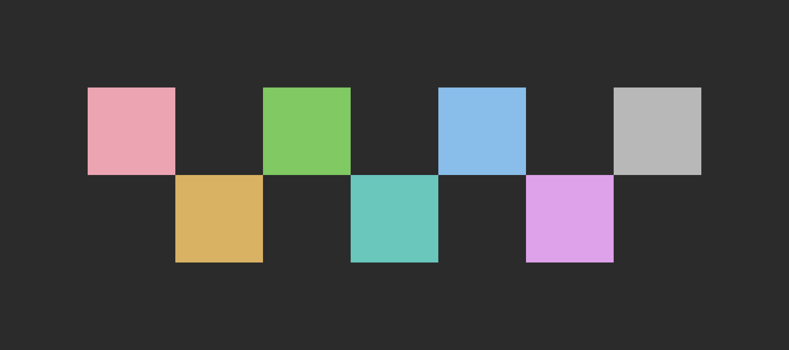
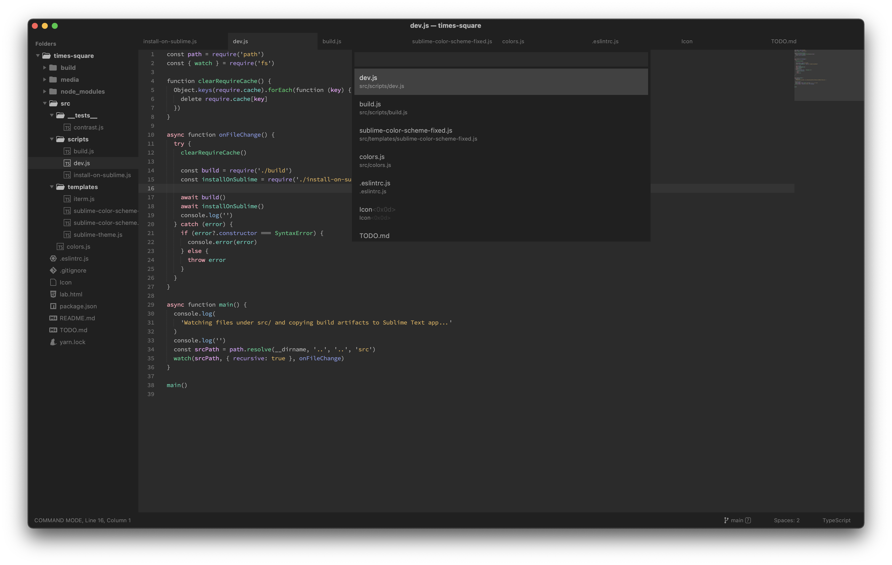
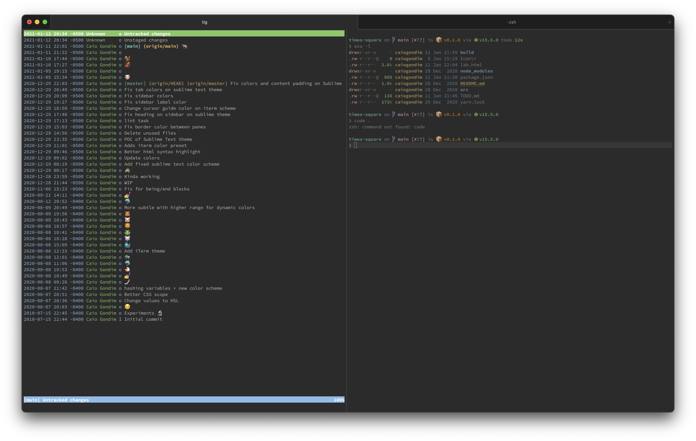

# 🏙️ Times Square

- Uses whole spectrum of colors
- Semantic highlighting
- Between all foreground colors and background:
  - Same perceptual constranst using [HSLuv](https://www.hsluv.org) algorithm
  - AA 7.0 constrast for better readability and accessibility
  - No more than 7.0 contrast for reduced eye strain

## Colors



## Screenshots

### Sublime Text

- Times Square color scheme
- Times Square theme



### iTerm

- Times Square color scheme
- [Starship](https://starship.rs)



## Instalation

```bash
# For Sublime Text on macOS
yarn install-on-sublime

# For iTerm on macOS
yarn install-on-iterm

# For other platforms
cp ./build/Times\ Square.sublime-color-scheme path/to/your/sublime-text/packages/folder
cp ./build/Times\ Square.sublime-theme path/to/your/sublime-text/packages/folder
```

## Sponsor

If you found this project useful consider transfering some
bitcoins to `1BqqKiZA8Tq43CdukdBEwCdDD42jxuX9UY`.

---

[caiogondim.com](https://caiogondim.com) &nbsp;&middot;&nbsp;
GitHub [@caiogondim](https://github.com/caiogondim) &nbsp;&middot;&nbsp;
Twitter [@caio_gondim](https://twitter.com/caio_gondim)
